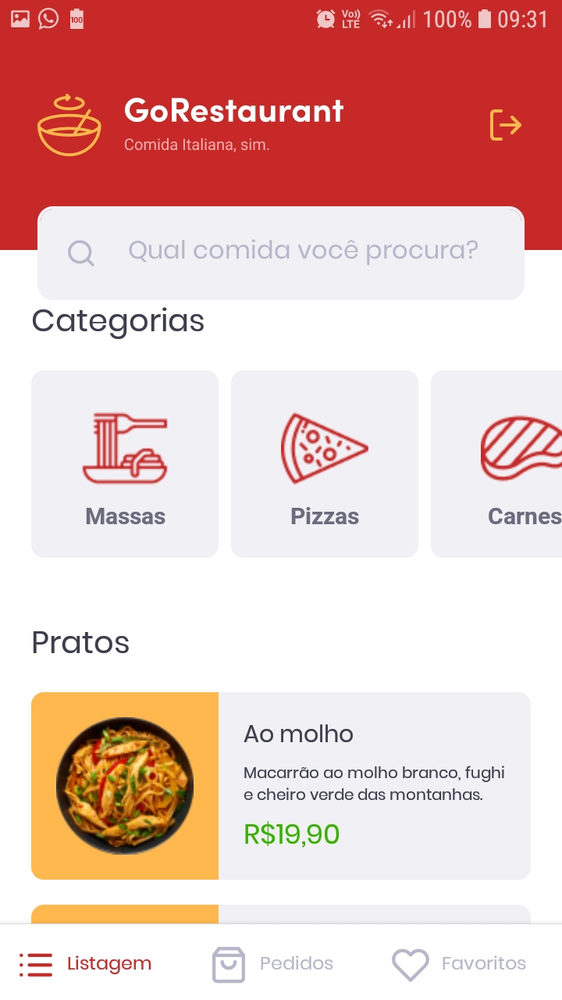
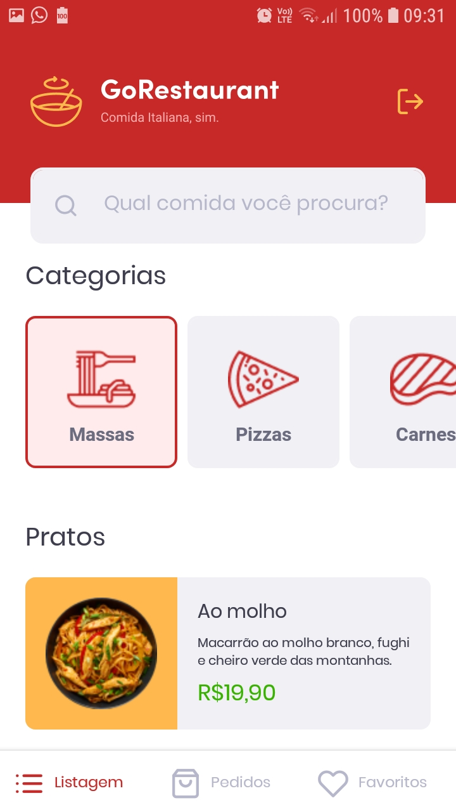
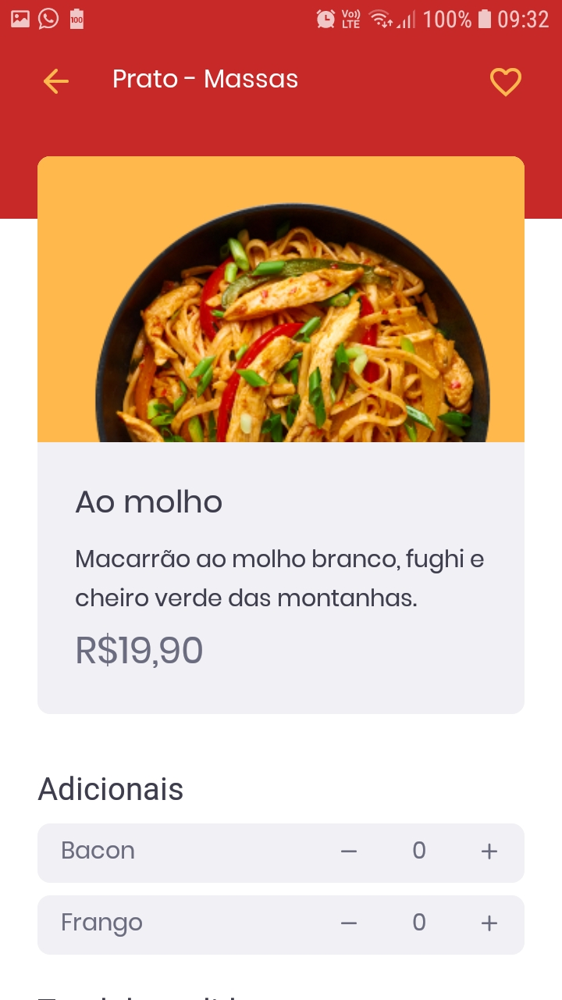
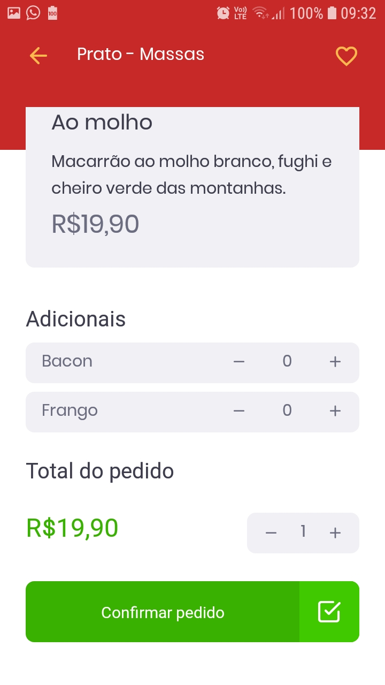
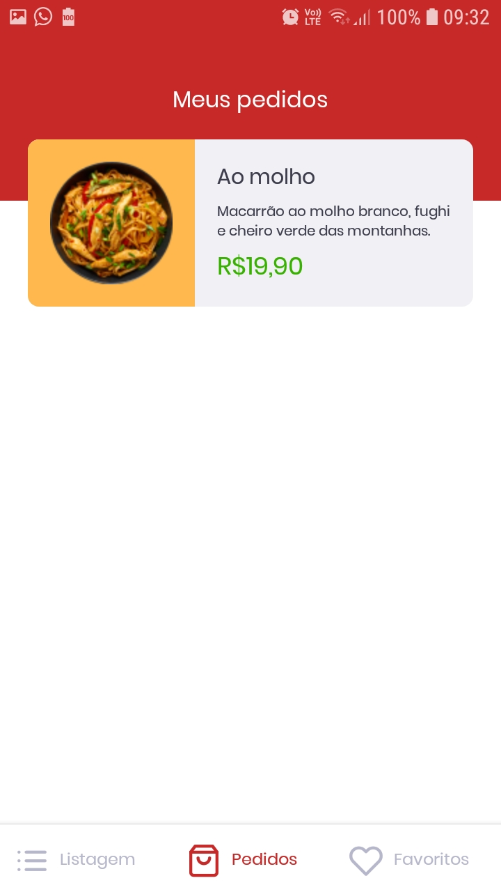
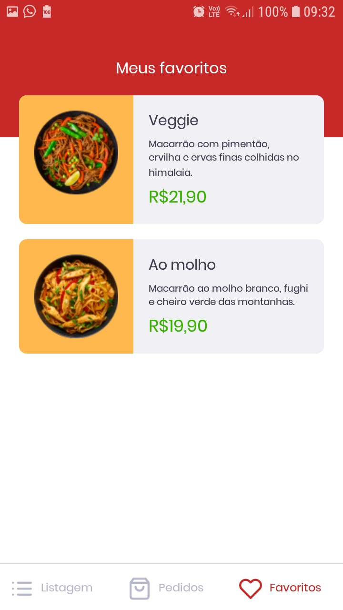

# desafio11
GoRestaurant Mobile

# Status
<h4 align="center"> 
	🚧  Go Restaurant Mobile 🚀 Concluído  🚧
</h4>

# Features

- [x] Listar de pratos(comidas)
- [x] Selecionar pratos(comidas)
- [x] Favoritar pratos(comidas)
- [x] Adicionar/Remover extra aos pratos(comidas)
- [x] Subtotal

# Banner

<h1 align="center">
  
</h1>

<h1 align="center">
  
</h1>

<h1 align="center">
  
</h1

<h1 align="center">
  
</h1

<h1 align="center">
  
</h1

<h1 align="center">
  
</h1

<h1 align="center">
  
</h1

# Como rodar a aplicação


### 🎲 Rodando o Mobile (frontend)

```bash
# Clone este repositório
$ git clone <https://github.com/cesarvaz-filho/desafio11>

# Vá para a pasta do projeto
$ cd desafio11

# Instale as dependências
$ npm install ou yarn

# Execute a aplicação em modo de desenvolvimento
$ yarn start (para abrir o app)
$ yarn json-server server.json -p 3333 (para a fakeAPI)

# O servidor inciará na porta:3333

#OBS:. Caso o app não liste os pratos execute o comando abaixo e reinicie a fakeAPI
$adb reverse tcp:3333 tcp: 3333
```

# Autor

Feito com dedicação por César Vaz.
- [GitHub](https://github.com/cesarvaz-filho)
- [Linkedin](https://www.linkedin.com/in/cesar-vaz-059667175/)
- Email: cesar_augusto_perfil@hotmail.com
- Entre em contato!👋🏽🚀

# Licença
MIT
